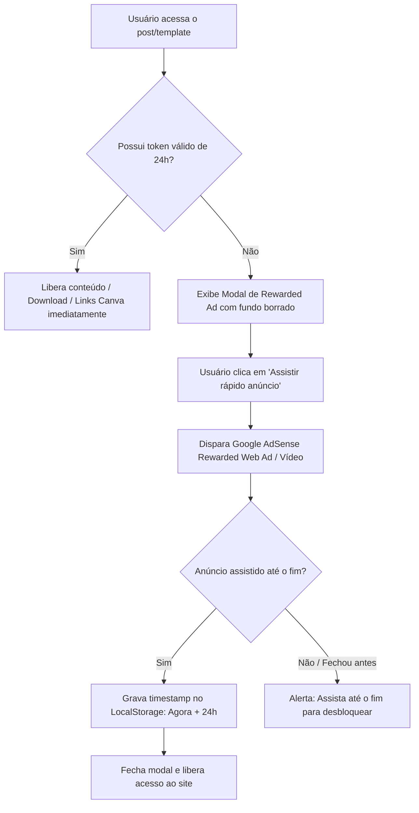

# 🎯 Estratégia de Monetização: Rewarded Ad-Wall (Passe Livre de 24 Horas)

> **Referência:** Modelo identificado no site *Imprinté* (artigos com templates/materiais gratuitos onde o usuário assiste a um anúncio em vídeo para desbloquear 24h de acesso irrestrito).

---

## 💡 O que é e Por Que Funciona Tão Bem?

Esse modelo é uma evolução direta dos **Rewarded Ads (Anúncios Premiados)** de jogos mobile, adaptado com maestria para a Web / Blogs de conteúdo (Canva templates, materiais de design, downloads, ferramentas, tutoriais).

### 🧠 Psicologia & Benefícios de Conversão:
1. **Percepção de Troca Justa (Fair Value Exchange):** Em vez de entupir a página com 15 banners irritantes que o usuário bloqueia com AdBlock, você propõe um acordo claro: *"Assista um anúncio rapidinho e ganhe 24h de passe livre em todo o site"*.
2. **eCPM Muito Mais Alto:** Anúncios em vídeo/interstitial com visualização garantida (Rewarded / Interstitial Ads) pagam os maiores CPMs do mercado publicitário (frequentemente entre **\$5 e \$30+ por mil visualizações completas**, contra \$0.50 - \$2 de banners normais).
3. **Sensação de "Modo VIP / Premium":** O usuário sente que desbloqueou uma assinatura gratuita por 24 horas. Ele navega livremente pelo resto do dia sem ser interrompido novamente.
4. **Anti-AdBlock Natural:** Como o conteúdo/link de download só é liberado mediante o evento de sucesso do anúncio, o usuário desativa o adblock ou assiste de bom grado.

---

## 📸 As 2 Etapas do Fluxo Real (Exemplo Imprinté):

1. **Etapa 1 (Consentimento / O Convite):**  
   Um modal limpo com a logo da marca explicando que o conteúdo é gratuito e oferecendo a troca: *"Assista um rápido anúncio -> Acesso a todo o site por 24 horas"*.
2. **Etapa 2 (A Exibição do Anúncio Premiado):**  
   Ao clicar, abre o contêiner central do anúncio (ex: Anúncio da LATAM Airlines / Google AdSense Interstitial) com o botão de fechar/completar no topo. Ao terminar, o site fica 100% liberado!

---

## 🛠️ Como Funciona o Fluxo Técnico



---

## 💻 Código Pronto para Implementação (HTML / CSS / JS)

### 1. Script de Controle de Acesso (LocalStorage 24 Horas)

```html
<!-- Modal de Bloqueio -->
<div id="rewarded-gate-modal" class="rewarded-modal-overlay" style="display: none;">
  <div class="rewarded-modal-card">
    <div class="brand-header">
      <h2 class="brand-logo">MeuBlog<span>®</span></h2>
    </div>
    
    <h3 class="modal-title">Assista e acesse mais conteúdos</h3>
    <p class="modal-subtitle">Assista o anúncio rapidinho para continuar a ver nossos conteúdos gratuitos</p>
    
    <button id="btn-watch-ad" class="ad-cta-button" onclick="startRewardedAd()">
      <div class="btn-info">
        <span class="btn-main-text">Assista um rápido anúncio</span>
        <span class="btn-sub-text">Acesso a todo o site por 24 horas</span>
      </div>
      <div class="btn-icon">
        <svg viewBox="0 0 24 24" fill="currentColor" width="24" height="24">
          <path d="M12 2C6.48 2 2 6.48 2 12s4.48 10 10 10 10-4.48 10-10S17.52 2 12 2zm-2 14.5v-9l6 4.5-6 4.5z"/>
        </svg>
      </div>
    </button>
  </div>
</div>

<style>
.rewarded-modal-overlay {
  position: fixed;
  inset: 0;
  background: rgba(0, 0, 0, 0.65);
  backdrop-filter: blur(8px);
  display: flex;
  align-items: center;
  justify-content: center;
  z-index: 99999;
  padding: 16px;
}
.rewarded-modal-card {
  background: #ffffff;
  border-radius: 20px;
  max-width: 480px;
  width: 100%;
  padding: 32px 24px;
  text-align: center;
  box-shadow: 0 20px 40px rgba(0, 0, 0, 0.2);
  font-family: system-ui, -apple-system, sans-serif;
}
.brand-logo {
  font-size: 32px;
  color: #14b8a6;
  font-weight: 700;
  margin-bottom: 8px;
}
.modal-title {
  font-size: 24px;
  color: #0f766e;
  font-weight: 700;
  margin: 12px 0 6px;
}
.modal-subtitle {
  color: #64748b;
  font-size: 15px;
  margin-bottom: 24px;
  line-height: 1.4;
}
.ad-cta-button {
  background: #ffffff;
  border: 1.5px solid #cbd5e1;
  border-radius: 14px;
  padding: 14px 18px;
  display: flex;
  align-items: center;
  justify-content: space-between;
  width: 100%;
  cursor: pointer;
  transition: all 0.2s ease;
  text-align: left;
}
.ad-cta-button:hover {
  border-color: #0f766e;
  background: #f0fdfa;
  transform: translateY(-2px);
  box-shadow: 0 4px 12px rgba(15, 118, 110, 0.12);
}
.btn-main-text {
  display: block;
  font-weight: 700;
  font-size: 16px;
  color: #0f766e;
}
.btn-sub-text {
  display: block;
  font-size: 13px;
  color: #64748b;
  margin-top: 2px;
}
.btn-icon {
  color: #0f766e;
}
</style>
```

### 2. Lógica JavaScript de Validação & Liberação 24 Horas

```javascript
const ACCESS_STORAGE_KEY = 'blog_rewarded_access_expires';
const ACCESS_DURATION_MS = 24 * 60 * 60 * 1000; // 24 Horas

function hasValidAccess() {
  const expiresAt = localStorage.getItem(ACCESS_STORAGE_KEY);
  if (!expiresAt) return false;
  return Date.now() < parseInt(expiresAt, 10);
}

function grant24HourAccess() {
  const expiresAt = Date.now() + ACCESS_DURATION_MS;
  localStorage.setItem(ACCESS_STORAGE_KEY, expiresAt.toString());
  
  // Esconde o modal
  const modal = document.getElementById('rewarded-gate-modal');
  if (modal) modal.style.display = 'none';
  
  console.log('✅ Acesso liberado por 24 horas!');
}

function checkAccessOnLoad() {
  if (!hasValidAccess()) {
    // Exibe o modal se não tiver acesso ativo
    const modal = document.getElementById('rewarded-gate-modal');
    if (modal) modal.style.display = 'flex';
  }
}

// Executar ao carregar a página
document.addEventListener('DOMContentLoaded', checkAccessOnLoad);
```

---

## 📡 Como Integrar com as Redes de Anúncios

### Opção 1: Google AdSense (Rewarded Web Ads - Oficial)
O Google AdSense possui suporte nativo para **Anúncios Premiados na Web (Rewarded Web Ads)**:
```javascript
function startRewardedAd() {
  if (window.adsbygoogle) {
    window.adsbygoogle.push({
      google_ad_client: "ca-pub-XXXXXXXXXXXXXXXX",
      enable_page_level_ads: true,
      overlays: { rewarded: true },
      onRewarded: function() {
        // Callback oficial do AdSense disparado após o usuário ver o anúncio
        grant24HourAccess();
      },
      onDismissed: function() {
        console.log('Usuário fechou o anúncio sem completar');
      }
    });
  } else {
    // Fallback de teste (caso esteja em localhost)
    alert('Simulação de anúncio assistido!');
    grant24HourAccess();
  }
}
```

### Opção 2: Google Ad Manager (GPT - Google Publisher Tag Rewarded)
O Google Publisher Tag possui a API `googletag.defineOutOfPageSlot` com `googletag.enums.OutOfPageFormat.REWARDED`:
```javascript
googletag.cmd.push(() => {
  const rewardedSlot = googletag.defineOutOfPageSlot(
    '/1234567/rewarded_ad_unit',
    googletag.enums.OutOfPageFormat.REWARDED
  );
  
  if (rewardedSlot) {
    rewardedSlot.addService(googletag.pubads());
    googletag.pubads().addEventListener('rewardedSlotGranted', (event) => {
      // Recompensa concedida!
      grant24HourAccess();
    });
    googletag.display(rewardedSlot);
  }
});
```

### Opção 3: Outras Redes / Content Lockers Alternativos
- **Monetag / PropellerAds:** Possuem formato de *Rewarded Interstitial* e *Content Locker* com webhook/JS callback.
- **Adsterra / Ezoic:** Suportam formatos em vídeo com trigger de liberação de download.

---

## 🎨 Controle Total: Onde e Como Você Pode Posicionar no Seu Blog

Você tem **100% de controle** sobre o design, textos, cores e, principalmente, sobre **o gatilho/posição** de disparo. O Google só fornece o anúncio; toda a lógica do site é sua!

### 4 Formas Estratégicas de Posicionamento:

#### 1. Gatilho no Botão de Download / Link do Canva (⭐ O mais recomendado):
* O usuário lê o post normalmente, vê todas as fotos e se apaixona pelo template.
* Quando clica em **"Baixar Template Grátis"** ou **"Abrir no Canva"**, o modal abre.
* **Por que é o melhor:** A taxa de conversão passa de **90%**, porque a pessoa já tomou a decisão de querer o material.

#### 2. Gatilho de Entrada com Blur (Modelo do Imprinté):
* Ao carregar a página de templates, o fundo fica borrado (*backdrop-filter: blur*) e o modal surge no centro.
* Garante que praticamente 100% do tráfego assista ao anúncio antes de consumir.

#### 3. Gatilho Freemium (Ex: 1 Grátis por dia, depois pede anúncio):
* O visitante pode baixar 1 template direto sem anúncio.
* A partir do 2º ou 3º template no mesmo dia, o sistema ativa a trava de 24h.
* Gera altíssima fidelização e confiança no visitante.

#### 4. Card Fixo / Inline no meio do Conteúdo:
* Em vez de um pop-up que tampa a tela inteira, você pode colocar um card bonito no meio do artigo com um cadeado: *"🔒 Conteúdo Bloqueado - Clique para assistir 15s e desbloquear todo o tutorial"*.


### 1. É você quem escolhe o anunciante (ex: LATAM)?
**Não diretamente, tudo é 100% automático!**
* Você **não precisa** correr atrás de marcas nem negociar contratos.
* O sistema funciona via **Leilão em Tempo Real (RTB - Real Time Bidding)** do **Google AdSense / Google Ad Manager**.
* Quando o visitante clica no botão, o Google faz um leilão de milissegundos entre milhares de empresas (LATAM, Shopee, Nubank, Amazon, etc.). A empresa que pagar mais para aparecer para aquele perfil específico de usuário vence o leilão e é exibida.
* **O que você controla:** No painel do Google, você pode definir regras de bloqueio (ex: bloquear categorias como jogos de azar, apostas, política, ou concorrentes diretos).

---

### 2. Qual é a Rentabilidade? (eCPM & Estimativas de Ganhos)

A métrica padrão do mercado é o **eCPM** (*Custo Efetivo por Mil visualizações* = quanto você ganha a cada 1.000 pessoas que assistem/fecham o anúncio).

| Formato de Anúncio | eCPM Médio (Brasil) | eCPM Médio (EUA / Global) | Retenção / Atenção |
| :--- | :--- | :--- | :--- |
| **Banner Comum de Post** | R\$ 1,50 a R\$ 6,00 | \$1.00 a \$3.00 | Baixa (cegueira de banner / AdBlock) |
| **Rewarded Web / Interstitial (Esse modelo)** | **R\$ 15,00 a R\$ 80,00+** | **\$8.00 a \$35.00+** | **Altíssima (100% visível, quase sem AdBlock)** |

---

### 📊 Simulação de Faturamento Mensal (Exemplo Prático com Blog de Templates):

Supondo um blog de templates Canva / Vision Board / Artes com tráfego orgânico (Google / Pinterest):

| Visitas / Mês | Desbloqueios (Assistiram ao Anúncio) | Ganho Estimado (eCPM R\$ 35) | Ganho Estimado (eCPM R\$ 60) |
| :--- | :--- | :--- | :--- |
| **10.000** | 7.000 | **R\$ 245,00 / mês** | **R\$ 420,00 / mês** |
| **30.000** | 20.000 | **R\$ 700,00 / mês** | **R\$ 1.200,00 / mês** |
| **100.000** | 70.000 | **R\$ 2.450,00 / mês** | **R\$ 4.200,00 / mês** |
| **300.000** | 200.000 | **R\$ 7.000,00 / mês** | **R\$ 12.000,00 / mês** |

> 💡 **Nota:** Se você atrair tráfego internacional (em inglês ou espanhol), esses valores dobram ou triplicam porque os anunciantes de fora pagam em dólar/euro com CPMs muito mais agressivos.

